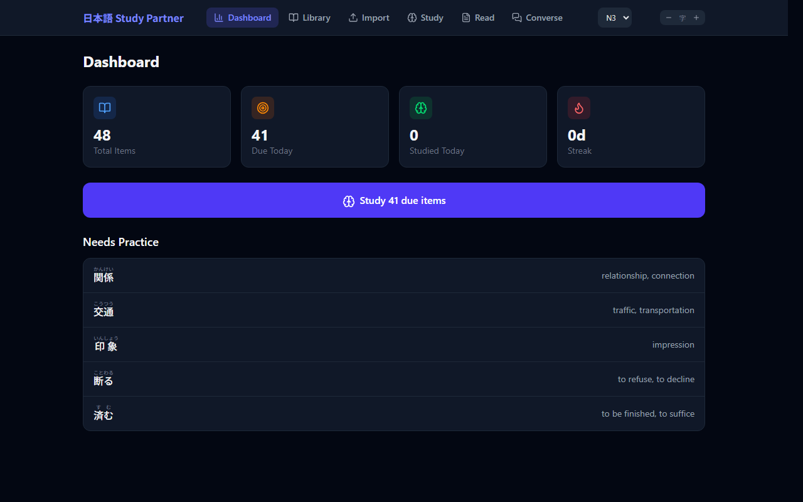
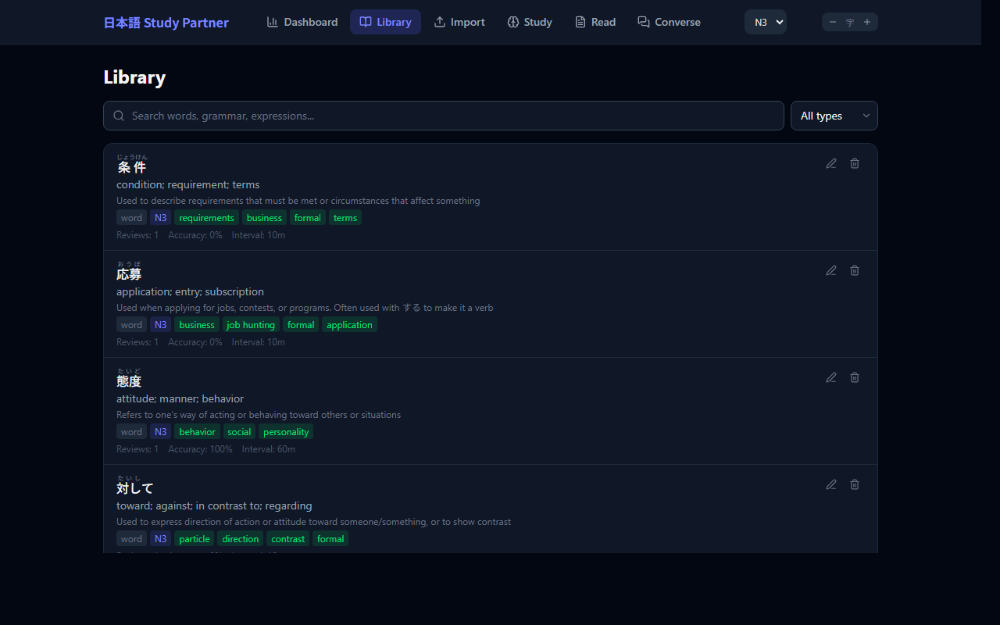

# 日本語 Study Partner

A personal Japanese language learning app with spaced repetition, AI-powered content ingestion, conversation practice with local speech-to-text, and adaptive study modes. Difficulty adapts to a sticky JLPT level setting (N1–N5).

## Tech Stack

| Layer | Technology |
|-------|-----------|
| Backend | Python 3.11+, FastAPI, SQLAlchemy, SQLite |
| Frontend | React 19, Vite 8, Tailwind CSS 4 |
| AI | Anthropic Claude API (Sonnet 4) |
| JP Parsing | fugashi + unidic-lite |
| Speech-to-text | faster-whisper (CTranslate2) — local, Japanese-tuned Kotoba-Whisper by default |
| Package Mgmt | uv (Python), npm (JS) |

## Project Structure

```
jp_study_partner/
├── .env                          # ANTHROPIC_API_KEY (create from .env.example)
├── .env.example
├── start.sh / start.ps1          # Start both servers (bash / PowerShell)
├── stop.sh  / stop.ps1           # Stop both servers (frees ports 8000 & 5173)
├── docs/screenshots/             # README screenshots
│
├── backend/
│   ├── pyproject.toml            # Python deps (managed by uv); pytest in the `dev` group
│   ├── nihongo.db                # SQLite database (created at runtime)
│   ├── tests/                    # pytest suite: srs, llm parser, non-AI API smoke
│   └── app/
│       ├── main.py               # FastAPI app, CORS, static file serving
│       ├── database.py           # SQLAlchemy engine & session config
│       ├── models.py             # ORM models: Item, Tag, Source, Setting, StudySession
│       ├── schemas.py            # Pydantic request/response schemas
│       ├── srs.py                # Spaced repetition algorithm
│       ├── llm.py                # Shared helper for parsing JSON out of Claude responses
│       └── routers/
│           ├── items.py          # CRUD for study items
│           ├── study.py          # Due items, reviews, sessions, dashboard
│           ├── ingest.py         # Text/URL/PDF ingestion via Claude API
│           ├── generate.py       # AI question generation for drills & reading
│           ├── furigana.py       # Furigana annotation via fugashi tokenizer
│           ├── settings.py       # JLPT level setting + per-level prompt tuning
│           ├── transcribe.py     # Local Whisper (faster-whisper) audio → text
│           └── converse.py       # AI conversation tutor: open-ended Q&A + corrections
│
└── frontend/
    ├── vite.config.js            # Vite config with Tailwind & API proxy
    ├── index.html
    └── src/
        ├── main.jsx              # React entry with BrowserRouter
        ├── App.jsx               # Shell: header, nav, JLPT level + font-size controls, routing
        ├── api.js                # API client (all fetch calls)
        ├── index.css             # Tailwind imports, dark theme, JP fonts, ruby + skeleton styling
        ├── context/
        │   └── LevelContext.jsx  # React context for the sticky JLPT level
        ├── components/
        │   ├── Ruby.jsx          # Furigana component (batched, cached kanji annotations)
        │   ├── ReadingText.jsx   # Tokenized passage with per-word click-to-lookup popovers
        │   ├── LevelBadge.jsx    # JLPT level pill shown on study/reading/converse headers
        │   └── Skeleton.jsx      # Shimmer skeleton primitives (Skeleton, SkeletonLine)
        └── pages/
            ├── Dashboard.jsx     # Stats, due items, weak areas, streak
            ├── Items.jsx         # Library: search, filter, inline edit, delete
            ├── Study.jsx         # Flashcards & AI-generated drills with SRS
            ├── Reading.jsx       # AI reading practice with library + new vocabulary
            ├── Converse.jsx      # Conversation mode: tutor prompts, typed/spoken replies, corrections
            └── Ingest.jsx        # Import content via text/URL/PDF + AI extraction
```

## Database Schema

### Item
The core study unit. Can be a **word**, **grammar** point, or **expression**.

| Column | Type | Description |
|--------|------|-------------|
| id | int PK | |
| type | string | `word`, `grammar`, or `expression` |
| japanese | text | The Japanese text |
| reading | text | Hiragana reading |
| meaning | text | English meaning |
| notes | text | Usage notes |
| example_sentences | text | JSON array of `{japanese, english}` |
| jlpt_level | string | N1-N5 |
| source_id | int FK | Reference to Source |
| created_at | datetime | |
| srs_interval | float | Days until next review |
| srs_ease | float | Difficulty factor (1.3-3.0, default 2.5) |
| srs_due | datetime | When the item is next due |
| srs_reviews | int | Total review count |
| srs_correct | int | Correct answer count |

### Tag
Many-to-many with Item via `item_tags` join table.

### Source
Where study material came from. Fields: `title`, `type` (url/pdf/text/manual), `url`, `content`, `created_at`. Has many Items.

### Setting
Key/value app settings. Currently stores `jlpt_level` (N1–N5, default N3).

### StudySession
Tracks study sessions. Fields: `started_at`, `ended_at`, `items_reviewed`, `items_correct`, `mode` (one of `flashcard_jp`, `flashcard_en`, `fill_blank`, `sentence_build`, `converse`).

## API Endpoints

Base URL: `http://localhost:8000/api`

### Items (`/api/items`)
| Method | Path | Description |
|--------|------|-------------|
| GET | `/items/` | List items. Query: `type`, `search`, `tag`, `limit`, `offset` |
| POST | `/items/` | Create item |
| GET | `/items/{id}` | Get single item |
| PUT | `/items/{id}` | Update item (partial) |
| DELETE | `/items/{id}` | Delete item |

### Study (`/api/study`)
| Method | Path | Description |
|--------|------|-------------|
| GET | `/study/due` | Get items due for review. Query: `limit`, `type` |
| POST | `/study/review` | Submit review. Body: `{item_id, rating}` where rating is `again`/`hard`/`good` |
| GET | `/study/dashboard` | Stats: total, due, studied today, accuracy, weak items, streak |
| POST | `/study/session/start` | Start session. Query: `mode` |
| POST | `/study/session/{id}/end` | End session. Query: `items_reviewed`, `items_correct` |

### Ingest (`/api/ingest`)
| Method | Path | Description |
|--------|------|-------------|
| POST | `/ingest/text` | Extract items from pasted text (Form: `content`) |
| POST | `/ingest/url` | Extract items from URL (Form: `url`) |
| POST | `/ingest/pdf` | Extract items from PDF upload (Form: `file`) |
| POST | `/ingest/save` | Save reviewed items to DB (Form: `source_title`, `source_type`, `source_url`, `items_json`) |

### Generate (`/api/generate`)
| Method | Path | Description |
|--------|------|-------------|
| POST | `/generate/question` | AI-generated question. Query: `item_id`, `mode` (`fill_blank`/`sentence_build`/`grammar_drill`) |
| POST | `/generate/reading` | Generate reading passage using library words + new vocabulary. Form: `prompt` (optional topic guidance) |

### Furigana (`/api/furigana`)
| Method | Path | Description |
|--------|------|-------------|
| POST | `/furigana/annotate` | Annotate texts with furigana ruby HTML. Body: `{texts: string[]}` → `{results: string[]}` |
| POST | `/furigana/tokenize` | Split text into tokens with surface/reading/lemma, merging meanings from a supplied word list. Used by the reading-page word popover. |
| POST | `/furigana/lookup` | Claude-powered single-word gloss for on-the-fly lookups. Cached per lemma in-process. |

### Settings (`/api/settings`)
| Method | Path | Description |
|--------|------|-------------|
| GET | `/settings/` | Get app settings (currently `{jlpt_level}`) |
| PUT | `/settings/` | Update settings. Body: `{jlpt_level: "N1"..."N5"}` |

### Transcribe (`/api/transcribe`)
| Method | Path | Description |
|--------|------|-------------|
| POST | `/transcribe/` | Transcribe an audio upload (multipart `audio`) to Japanese text. Uses local faster-whisper. First call lazy-loads the model (slow on first run). |

### Converse (`/api/converse`)
| Method | Path | Description |
|--------|------|-------------|
| POST | `/converse/start` | Open a new conversation. Returns `{topic, question, english_hint}` calibrated to current JLPT level. |
| POST | `/converse/reply` | Body: `{history: [{role, content}], user_text}`. Returns `{corrections, rewrite, feedback, follow_up, follow_up_hint}`. |

## SRS Algorithm

Simple spaced repetition with three ratings:

| Rating | Effect |
|--------|--------|
| **Again** | Reset interval to ~10 min, ease -0.2 |
| **Hard** | Short interval (1hr if new, else x1.2), ease -0.1 |
| **Good** | Standard interval (1 day if new, else x ease), ease +0.05 |

Ease factor is clamped to [1.3, 3.0]. Items are due when `srs_due <= now`, ordered by most overdue first.

## Study Modes

1. **JP to EN Flashcard** - See Japanese, recall English meaning
2. **EN to JP Flashcard** - See English, recall Japanese
3. **Fill in the Blank** - AI generates a sentence with the target word blanked out, 4 multiple-choice options
4. **Sentence Building** - Given an English prompt, write the Japanese sentence (free-form input)

Modes 1–4 use SRS rating after each card.

5. **Reading Practice** - AI generates a short passage using words from your library + new vocabulary. Accepts optional topic prompt. Shows furigana, toggleable translation, and word list. New words can be added to library with one click.
6. **Conversation** - Open-ended Japanese Q&A. The tutor asks a level-appropriate question; you reply by typing or by recording audio (local Whisper transcription). Returns inline corrections, a natural rewrite of your answer, short feedback, and a follow-up question. Each submitted turn is logged to the study session.

## JLPT Level Setting

A single sticky setting (N1–N5, default N3) scales AI-generated content: ingest extraction focus, question difficulty, reading-passage length, and conversation topic depth. Items stored in the DB (manual entry or ingest) are always available regardless of the level. Change it from the header dropdown — it's persisted server-side and mirrored in `localStorage` for instant load.

## Running

### Prerequisites
- Python 3.11+
- Node.js 18+
- [uv](https://docs.astral.sh/uv/) (Python package manager)

### Setup
```bash
cp .env.example .env
# Edit .env and add your Anthropic API key

cd backend && uv sync && cd ..
cd frontend && npm install && cd ..
```

### Development
```bash
bash start.sh         # macOS / Linux / Git Bash
.\start.ps1           # Windows PowerShell
# Backend:  http://localhost:8000
# Frontend: http://localhost:5173

bash stop.sh          # or .\stop.ps1 — kills both servers, frees the ports
```

Both start scripts call their stop counterpart first to clear stale processes, then write `.dev-pids.json` so the stop script can tree-kill the servers (and their grandchildren — uvicorn `--reload` and `npm → node` spawn deep trees).

Or run separately:
```bash
# Terminal 1
cd backend && uv run uvicorn app.main:app --reload --host 0.0.0.0 --port 8000

# Terminal 2
cd frontend && npm run dev -- --host 0.0.0.0
```

### Testing
```bash
cd backend && uv sync --group dev     # installs pytest once
cd backend && uv run pytest           # runs the suite (<1s)
```
Covers the SRS algorithm, the shared LLM JSON-response parser, and TestClient smoke tests for the non-AI API (items CRUD, study/review/session, settings, health). AI-backed routes (`ingest`, `generate`, `converse`, `transcribe`, `furigana/lookup`) are intentionally not tested — they hit external services.

### Production (single server)
```bash
cd frontend && npm run build && cd ..
cd backend && uv run uvicorn app.main:app --host 0.0.0.0 --port 8000
```
The backend serves the built frontend from `frontend/dist/` automatically.

### Access via Tailscale
Use `--host 0.0.0.0` (already set in the start scripts) to bind to all interfaces, then access via your Tailscale IP.

## Environment Variables

All loaded from `.env` at the project root via `python-dotenv`. See `.env.example`.

| Variable | Required | Default | Description |
|----------|----------|---------|-------------|
| `ANTHROPIC_API_KEY` | Yes (for Import, AI study, Reading, Converse) | — | Claude API key |
| `WHISPER_MODEL` | No | `kotoba-tech/kotoba-whisper-v2.0-faster` | faster-whisper model name or HF repo. Alternatives: `large-v3-turbo`, `large-v3`, `medium`, `small` |
| `WHISPER_DEVICE` | No | `auto` | `auto` / `cuda` / `cpu`. `auto` picks CUDA if available |
| `WHISPER_COMPUTE_TYPE` | No | `auto` | `auto` / `float16` / `int8_float16` / `int8` / `float32`. `auto` picks `float16` on GPU, `int8` on CPU |

The Kotoba-Whisper default is a Japanese-fine-tuned Whisper variant (~1.5 GB). It downloads to the Hugging Face cache on first transcription call.

## Data Flow

### Content Ingestion
Input (text/URL/PDF) -> backend extracts text -> sends to Claude with extraction prompt -> returns extracted vocab/grammar/expressions -> user reviews & selects -> `POST /api/ingest/save` -> creates Source + Items

### Study Session
Select mode -> `POST /study/session/start` -> `GET /study/due` (up to 20 items) -> show card/question -> user rates -> `POST /study/review` (updates SRS) -> next card -> `POST /study/session/{id}/end`

### Conversation Turn
`POST /converse/start` returns a question -> user types or records audio -> (audio path: `POST /transcribe/` -> text appended to textarea) -> `POST /converse/reply` with history + user text -> corrections, rewrite, follow-up rendered -> user clicks Continue to loop.

## Design Decisions

- **SQLite** over Postgres: single-user local app, zero setup, easy backup (copy the .db file)
- **No auth**: personal tool, secured at network level (Tailscale)
- **Claude Sonnet for ingestion/generation**: balances cost and quality across JLPT levels
- **Simple SRS over SM-2**: three buttons instead of five, easier to use, good enough for personal use
- **Dark mode only**: personal preference, easier on the eyes for study sessions
- **Local Whisper over cloud STT**: avoids per-minute API costs, keeps audio on-device, runs fast on the 3080. Kotoba-Whisper over vanilla large-v3 because it's Japanese-fine-tuned with better CER at lower latency
- **JLPT level stored server-side**: the app is used from multiple devices over Tailscale, so the DB is the source of truth; `localStorage` is only a cache for first-paint

## Screenshots




